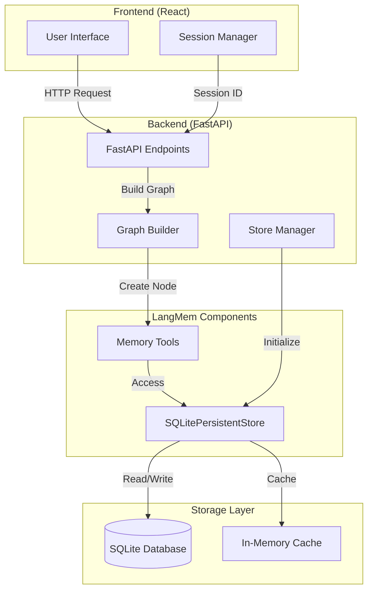
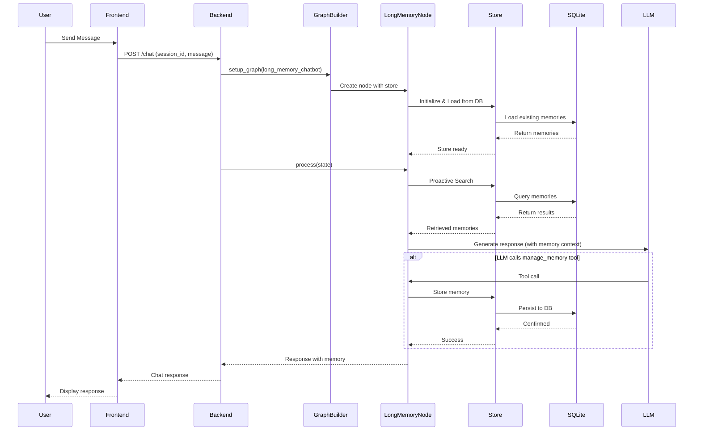
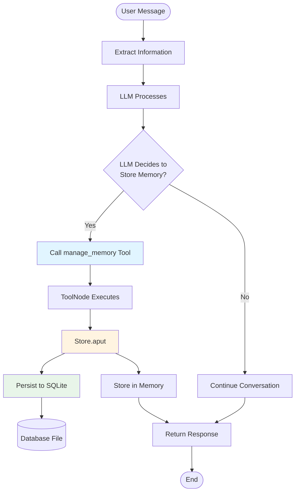
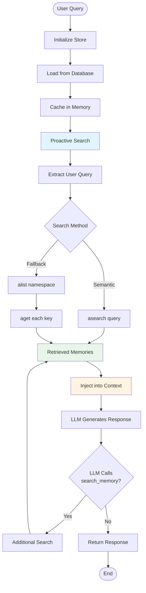
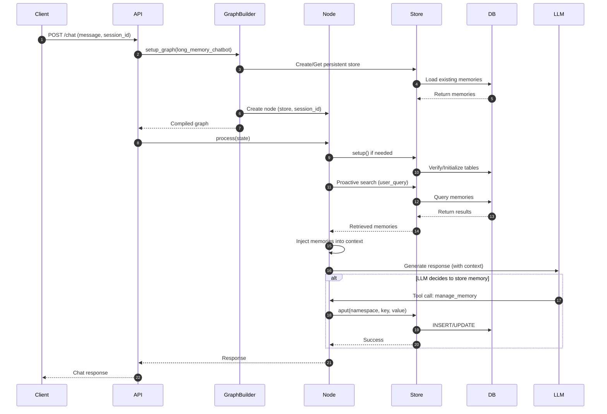
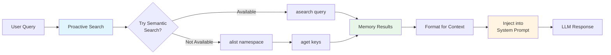
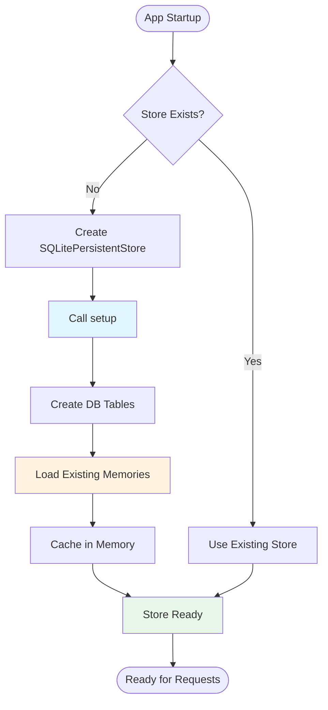
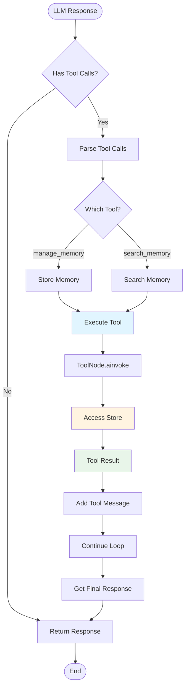
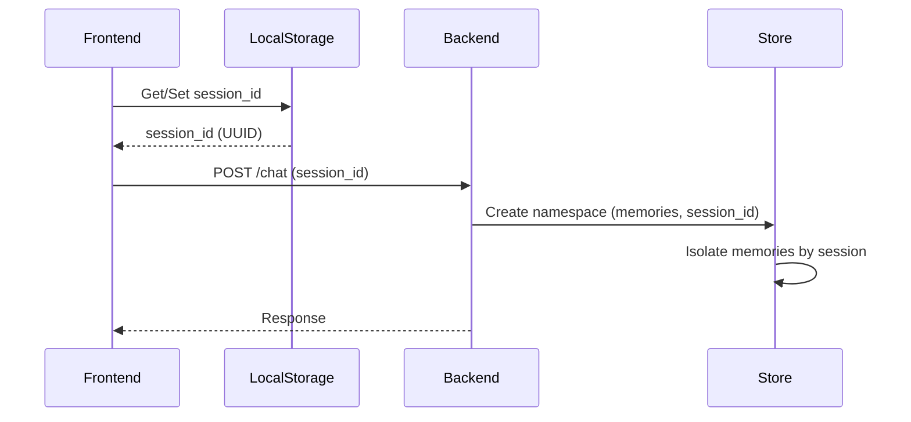

# LangMem Long Memory Implementation Documentation

## Table of Contents

1. [Overview](#overview)
2. [Architecture](#architecture)
3. [Components](#components)
4. [Data Flow](#data-flow)
5. [Memory Storage](#memory-storage)
6. [Memory Retrieval](#memory-retrieval)
7. [Configuration](#configuration)
8. [Usage Examples](#usage-examples)
9. [Troubleshooting](#troubleshooting)

## Overview

The Long Memory use case implements persistent memory capabilities using **LangMem**, a library by LangChain for long-term agent memory. This allows the chatbot to remember information across conversations and application restarts.

### Key Features

- **Persistent Storage**: Memories are stored in SQLite database and survive application restarts
- **Session Isolation**: Each session has its own isolated memory namespace
- **Proactive Retrieval**: Memories are automatically searched and injected into context before generating responses
- **Multi-Provider Support**: Works with all LLM providers (Groq, OpenAI, Gemini, Ollama, Anthropic)
- **Semantic Search**: Uses vector embeddings for intelligent memory retrieval

## Architecture

### High-Level Architecture



### Component Interaction Flow



## Components

### 1. LongMemoryChatbotNode

**Location**: `backend/langgraph_agent/nodes/long_memory_chatbot_node.py`

The main node that processes chat messages with memory capabilities.

#### Key Responsibilities

- Initialize and manage the persistent store
- Perform proactive memory search before generating responses
- Handle memory tool calls (store/retrieve)
- Inject retrieved memories into conversation context
- Execute memory tools when LLM requests them

#### Key Methods

- `__init__(model, store, session_id)`: Initialize node with LLM, store, and session
- `process(state)`: Main processing method that handles memory and generates responses

### 2. SQLitePersistentStore

**Location**: `backend/langgraph_agent/stores/persistent_store.py`

A custom store implementation that extends `InMemoryStore` and adds SQLite persistence.

#### Key Features

- Extends LangGraph's `InMemoryStore` for compatibility
- Persists all memory operations to SQLite database
- Loads existing memories on initialization
- Provides fallback retrieval from database if not in memory

#### Key Methods

- `setup()`: Initialize database and load existing data
- `aput(namespace, key, value)`: Store value in memory and database
- `aget(namespace, key)`: Retrieve value from memory or database
- `alist(namespace)`: List all keys in a namespace
- `adelete(namespace, key)`: Delete value from memory and database

### 3. LongMemoryChatbotGraph

**Location**: `backend/langgraph_agent/graphs/long_memory_chatbot_graph.py`

Graph builder function that creates the LangGraph workflow.

#### Function

- `long_memory_chatbot_build_graph(graph_builder, llm, store, session_id)`: Builds the graph with long memory node

### 4. Graph Builder Integration

**Location**: `backend/langgraph_agent/graphs/graph_builder.py`

The main graph builder that supports multiple use cases including long memory.

#### Integration Point

- Adds `long_memory_chatbot` case to `setup_graph()` method
- Compiles graph with store when provided

## Data Flow

### Memory Storage Flow



### Memory Retrieval Flow



### Complete Request Flow



## Memory Storage

### Storage Structure

Memories are stored in SQLite with the following structure:

**Table: `store_data`**
- `namespace`: JSON string of tuple `("memories", session_id)`
- `key`: Unique memory ID (UUID)
- `value`: JSON string of memory content

**Table: `index_data`** (for future vector search enhancement)
- `namespace`: JSON string of tuple
- `key`: Memory ID
- `vector`: Embedding vector (BLOB)
- `metadata`: JSON string of metadata

### Namespace Structure

Memories are namespaced by session ID:
```
Namespace: ("memories", "session-uuid-here")
```

This ensures:
- Each session has isolated memories
- Multiple users can use the same database
- Memories don't leak between sessions

### Storage Process

1. **Memory Creation**: When LLM calls `manage_memory` tool with action "create"
2. **Store Operation**: Value is stored in both:
   - In-memory cache (for fast access)
   - SQLite database (for persistence)
3. **Persistence**: Database write happens synchronously with memory write

## Memory Retrieval

### Proactive Retrieval

Before generating a response, the system:

1. **Extracts User Query**: Gets the latest user message
2. **Searches Memory**: Queries the store for relevant memories
3. **Injects Context**: Adds retrieved memories to system prompt
4. **Generates Response**: LLM generates response with memory context

### Retrieval Methods

#### Method 1: Semantic Search (Preferred)
- Uses vector embeddings for semantic similarity
- Searches based on query meaning, not just keywords
- Returns most relevant memories

#### Method 2: List All (Fallback)
- Lists all memories in the namespace
- Gets values for recent memories
- Used when semantic search isn't available

### Retrieval Process



## Configuration

### Environment Variables

Add these to your `.env` file:

```bash
# LangMem Configuration
# Embedding model for memory vector search (default: openai:text-embedding-3-small)
LANGMEM_EMBED_MODEL=openai:text-embedding-3-small

# Custom path for SQLite database file (optional)
# Default: ./data/langmem_store.db
# LANGMEM_DB_PATH=./data/langmem_store.db
```

### Database Location

By default, the database is stored at:
```
backend/data/langmem_store.db
```

You can customize this with the `LANGMEM_DB_PATH` environment variable.

### Embedding Model

The default embedding model is `openai:text-embedding-3-small` which:
- Requires `OPENAI_API_KEY` to be set
- Provides 1536-dimensional embeddings
- Is cost-effective and fast

You can change this to other embedding models if needed.

## Usage Examples

### Basic Usage

1. **Select Long Memory Use Case**: Choose "Long Memory" from the use case dropdown
2. **Select Provider and Model**: Choose any supported LLM provider
3. **Start Chatting**: The agent will automatically remember information

### Example Conversation

```
User: "My name is John and I love pizza"
Agent: "Got it! I'll remember that your name is John and you love pizza."

[User closes app and restarts]

User: "What's my name?"
Agent: "Your name is John! Is there anything else you'd like me to remember?"
```

### Memory Operations

The agent can:
- **Store memories**: "Remember that I prefer dark mode"
- **Retrieve memories**: "What are my preferences?"
- **Update memories**: Automatically when new information is provided
- **Search memories**: Uses semantic search to find relevant information

## File Structure

```
backend/
├── langgraph_agent/
│   ├── nodes/
│   │   └── long_memory_chatbot_node.py    # Main memory node
│   ├── graphs/
│   │   └── long_memory_chatbot_graph.py    # Graph builder
│   ├── stores/
│   │   ├── __init__.py
│   │   └── persistent_store.py             # SQLite persistent store
│   └── states/
│       └── chatbotState.py                 # State definition
├── data/
│   └── langmem_store.db                    # SQLite database (auto-created)
└── main.py                                 # API endpoints
```

## Technical Details

### Store Initialization



### Memory Tool Execution



## Session Management

### Session ID Flow



### Session Isolation

Each session has its own memory namespace:
- Session A: `("memories", "session-a-uuid")`
- Session B: `("memories", "session-b-uuid")`

This ensures complete isolation between different users/conversations.

## Troubleshooting

### Memory Not Persisting

**Symptoms**: Memories are lost after restarting the application

**Solutions**:
1. Check database file exists: `backend/data/langmem_store.db`
2. Verify database permissions (write access)
3. Check logs for store initialization: `[STORE] Loaded X existing memories`
4. Verify `LANGMEM_DB_PATH` is correct if customized

### Memory Not Retrieving

**Symptoms**: Agent doesn't remember previously stored information

**Solutions**:
1. Check session ID is consistent (check logs: `[LONG MEMORY] Session ID: ...`)
2. Verify namespace matches: `[LONG MEMORY] Namespace: ('memories', 'session-id')`
3. Check proactive search logs: `[LONG MEMORY] Proactively searching memory...`
4. Verify memories exist in database (check `store_data` table)
5. Check for errors in logs during proactive search

### Store Initialization Errors

**Symptoms**: Errors during store setup

**Solutions**:
1. Ensure `aiosqlite` is installed: `uv sync`
2. Check database file path is writable
3. Verify embedding model API key is set (if using OpenAI embeddings)
4. Check logs for specific error messages

### Tool Execution Errors

**Symptoms**: Memory tools fail to execute

**Solutions**:
1. Verify store is initialized: `[LONG MEMORY] Store initialized: True`
2. Check store is passed to graph: `[LONG MEMORY] Executing tools with store available: True`
3. Verify namespace is correct in tool creation
4. Check for errors in tool execution logs

## Logging

The implementation includes comprehensive logging:

### Log Prefixes

- `[LONG MEMORY]`: Long memory node operations
- `[STORE]`: Store operations (put, get, list)
- `< MEMORY TOOL CALLS DETECTED >`: When LLM calls memory tools

### Key Log Messages

**Store Initialization**:
```
[STORE] Loaded X existing memories from database
[LONG MEMORY] Store initialized and loaded from database
```

**Memory Storage**:
```
[LONG MEMORY] Storing memory for session: <session-id>
[STORE] Storing value with namespace: ..., key: ...
[STORE] Value persisted to database successfully
```

**Memory Retrieval**:
```
[LONG MEMORY] Proactively searching memory for query: '...'
[LONG MEMORY] Found X total memories in namespace
[LONG MEMORY] Retrieved X memories from store
[LONG MEMORY] Injected memories into context
```

## Best Practices

1. **Session Management**: Use consistent session IDs for the same user
2. **Memory Cleanup**: Consider implementing memory expiration for old memories
3. **Database Backups**: Regularly backup the SQLite database file
4. **Monitoring**: Monitor database size and memory count
5. **Error Handling**: The implementation includes fallbacks for robustness

## Future Enhancements

Potential improvements:

1. **Vector Search**: Full implementation of semantic search with embeddings
2. **Memory Expiration**: Automatic cleanup of old memories
3. **Memory Consolidation**: Merge similar memories to reduce redundancy
4. **Multi-Database Support**: Support for PostgreSQL, MongoDB, etc.
5. **Memory Analytics**: Track memory usage and effectiveness

## API Reference

### Endpoints

- `POST /chat`: Send chat message with long memory support
  - Body: `{ message, session_id, use_case: "long_memory_chatbot", provider, selected_llm }`
  
- `GET /sessions?use_case=long_memory_chatbot`: List all sessions
- `GET /sessions/{session_id}`: Get session information

### Memory Tools

The agent has access to two memory tools:

1. **manage_memory**: Store, update, or delete memories
   - Actions: `create`, `update`, `delete`
   - Content: The information to store

2. **search_memory**: Search for relevant memories
   - Query: Search query string
   - Returns: Relevant memories

## Conclusion

The LangMem implementation provides robust, persistent memory capabilities that work across all LLM providers. The proactive search ensures memories are always available to the LLM, while the persistent storage ensures memories survive application restarts.

For questions or issues, check the logs for detailed debugging information.
